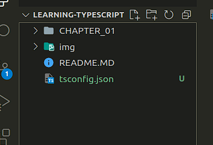

# [HOME PAGE 🏠](../README.MD)

- [HOME PAGE 🏠](#home-page-)
- [Part I. Concepts](#part-i-concepts)
  - [CHAPTER 1](#chapter-1)
    - [From JavaScript to TypeScript](#from-javascript-to-typescript)
    - [History of JavaScript](#history-of-javascript)
    - [Vanilla JavaScript’s Pitfalls](#vanilla-javascripts-pitfalls)
      - [Costly Freedom](#costly-freedom)
      - [Loose Documentation](#loose-documentation)
      - [Weaker Developer Tooling](#weaker-developer-tooling)
    - [TypeScript](#typescript)
    - [Getting Started in the TypeScript Playground](#getting-started-in-the-typescript-playground)
      - [TypeScript in Action](#typescript-in-action)
      - [Freedom Through Restriction](#freedom-through-restriction)
      - [Precise Documentation](#precise-documentation)
      - [Stronger Developer Tooling](#stronger-developer-tooling)
      - [Compiling Syntax](#compiling-syntax)
    - [Getting Started Locally](#getting-started-locally)
      - [Running Locally](#running-locally)
      - [Editor Features](#editor-features)
    - [What TypeScript Is Not](#what-typescript-is-not)
      - [A Remedy for Bad Code](#a-remedy-for-bad-code)
      - [Extensions to JavaScript (Mostly)](#extensions-to-javascript-mostly)
      - [Slower Than JavaScript](#slower-than-javascript)
      - [Finished Evolving](#finished-evolving)
    - [Summary](#summary)

# Part I. Concepts

## CHAPTER 1 

### From JavaScript to TypeScript

*JavaScript today
Supports browsers decades past
Beauty of the web*

Before talking about TypeScript, we need to first understand where it came from:
JavaScript!

### History of JavaScript

JavaScript was designed in 10 days by Brendan Eich at Netscape in 1995 to be
approachable and easy to use for websites. Developers have been poking fun at its
quirks and perceived shortcomings ever since. I’ll cover some of them in the next
section.

JavaScript has evolved tremendously since 1995, though! Its steering committee,
TC39, has released new versions of ECMAScript—the language specification that
JavaScript is based on—yearly since 2015 with new features that bring it in line
with other modern languages. Impressively, even with regular new language versions,
JavaScript has managed to maintain backward compatibility for decades in varying
environments, including browsers, embedded applications, and server runtime's.

Today, JavaScript is a wonderfully flexible language with a lot of strengths. One
should appreciate that while JavaScript has its quirks, it’s also helped enable the
incredible growth of web applications and the internet.

### Vanilla JavaScript’s Pitfalls

Developers often refer to using JavaScript without any significant language extensions
or frameworks as “vanilla”: referring to it being the familiar, original flavor. I’ll
soon go over why TypeScript adds just the right flavor to overcome these particular
major pitfalls, but it’s useful to understand just why they can be painful. All these
weaknesses become more pronounced the larger and longer-lived a project gets.

#### Costly Freedom

Many developers’ biggest gripe with JavaScript is unfortunately one of its key features:
JavaScript provides virtually no restrictions in how you structure your code. That
freedom makes it a ton of fun to start a project in JavaScript!

As you get to have more and more files, though, it becomes apparent how that
freedom can be damaging. Take the following snippet, presented out of context from
some fictional painting application:

```js
function paintPainting(painter, painting) {
return painter
.prepare()
.paint(painting, painter.ownMaterials)
.finish();
}
```

Reading that code without any context, you can only have vague ideas on how to call
the paintPainting function. Perhaps if you’ve worked in the surrounding codebase
you may recall that painter should be what’s returned by some getPainter function.
You might even make a lucky guess that painting is a string.

Even if those assumptions are correct, though, later changes to the code may invalidate
them. Perhaps painting is changed from a string to some other data type, or
maybe one or more of the painter’s methods are renamed.

Other languages might refuse to let you run code if their compiler determines it
would likely crash. Not so with dynamically typed languages—those that run code
without checking if it will likely crash first—such as JavaScript.

The freedom of code that makes JavaScript so fun becomes a real pain when you want
safety in running your code.

#### Loose Documentation

Nothing exists in the JavaScript language specification to formalize describing what
function parameters, function returns, variables, or other constructs in code are
meant to be. Many developers have adopted a standard called JSDoc to describe
functions and variables using block comments. The JSDoc standard describes how you might write documentation comments placed directly above constructs such as
functions and variables, formatted in a standard way. Here’s an example, again taken
out of context:

```js
/**
* Performs a painter painting a particular painting.
*
* @param {Painting} painter
* @param {string} painting
* @returns {boolean} Whether the painter painted the painting.
*/
function paintPainting(painter, painting) { /* ... */ }
```

JSDoc has key issues that often make it unpleasant to use in a large codebase:

- Nothing stops JSDoc descriptions from being wrong about code.
Even if your JSDoc descriptions were previously correct, during code refactors
- it can be difficult to find all the now-invalid JSDoc comments related to your
changes.
- Describing complex objects is unwieldy and verbose, requiring multiple standalone
comments to define types and their relationships.

Maintaining JSDoc comments across a dozen files doesn’t take up too much time, but
across hundreds or even thousands of constantly updating files can be a real chore.

#### Weaker Developer Tooling

Because JavaScript doesn’t provide built-in ways to identify types, and code easily
diverges from JSDoc comments, it can be difficult to automate large changes to
or gain insights about a codebase. JavaScript developers are often surprised to see
features in typed languages such as C# and Java that allow developers to perform class
member renamings or jump to the place an argument’s type was declared.

*You may protest that modern IDEs such as VS Code do provide
some development tools such as automated refactors to JavaScript.
True, but: they use TypeScript or an equivalent under the hood for
many of their JavaScript features, and those development tools are
not as reliable or as powerful in most JavaScript code as they are in
well-defined TypeScript code.*

### TypeScript

TypeScript was created internally at Microsoft in the early 2010s then released and
open sourced in 2012. The head of its development is Anders Hejlsberg, notable for
also having lead the development of the popular C# and Turbo Pascal languages.
TypeScript is often described as a “superset of JavaScript” or “JavaScript with types.”
But what is TypeScript?

TypeScript is four things:

- **Programming language**
A language that includes all the existing JavaScript syntax, plus new TypeScriptspecific
syntax for defining and using types

- **Type checker**
A program that takes in a set of files written in JavaScript and/or TypeScript,
develops an understanding of all the constructs (variables, functions…) created,
and lets you know if it thinks anything is set up incorrectly
- **Compiler**
A program that runs the type checker, reports any issues, then outputs the
equivalent JavaScript code

- **Language service**
A program that uses the type checker to tell editors such as VS Code how to
provide helpful utilities to developers

### Getting Started in the TypeScript Playground

You’ve read a good amount about TypeScript by now. Let’s get you writing it!

The main TypeScript website includes a “Playground” editor at <https://www.typescript>
lang.org/play. You can type code into the main editor and see many of the same
editor suggestions you would see when working with TypeScript locally in a full IDE
(Integrated Development Environment).

Most of the snippets in this book are intentionally small and self-contained enough
that you could type them out in the Playground and tinker with them for fun.

#### TypeScript in Action

Take a look at this code snippet:

```js
const firstName = "Georgia";
const nameLength = firstName.length();
// ~~~~~~
// This expression is not callable.
```

The code is written in normal JavaScript syntax—I haven’t introduced TypeScriptspecific
syntax yet. If you were to run the TypeScript type checker on this code, it
would use its knowledge that the length property of a string is a number—not a
function—to give you the complaint shown in the comment.

If you were to paste that code into the playground or an editor, it would be told by the
language service to give you a little red squiggly under length indicating TypeScript’s
displeasure with your code. Hovering over the squigglied code would give you the
text of the complaint

**TypeScript reporting an error on string length not being callable**


Being told of these simple errors in your editor as you type them is a lot more
pleasant than waiting until a particular line of code happens to be run and throw an
error. If you tried to run that code in JavaScript, it would crash!

#### Freedom Through Restriction

TypeScript allows us to specify what types of values may be provided for parameters
and variables. Some developers find having to explicitly write out in your code how
particular areas are supposed to work to be restrictive at first.

But! I would argue that being “restricted” in this way is actually a good thing! By
restricting our code to only being able to be used in the ways you specify, TypeScript
can give you confidence that changes in one area of code won’t break other areas of
code that use it.

If, say, you change the number of required parameters for a function, TypeScript will
let you know if you forget to update a place that calls the function.

In the following example, sayMyName was changed from taking in two parameters
to taking one parameter, but the call to it with two strings wasn’t updated and so is
triggering a TypeScript complaint:

```js
// Previously: sayMyName(firstName, lastName) { ...
function sayMyName(fullName) {
console.log(`You acting kind of shady, ain't callin' me ${fullName}`);
}
sayMyName("Beyoncé", "Knowles");
// ~~~~~~~~~
// Expected 1 argument, but got 2.
```

That code would run without crashing in JavaScript, but its output would be different
from expected (it wouldn’t include "Knowles"):

```bash
You acting kind of shady, ain't callin' me Beyoncé
```

Calling functions with the wrong number of arguments is exactly the sort of shortsighted
JavaScript freedom that TypeScript restricts.

#### Precise Documentation

Let’s look at a TypeScript-ified version of the paintPainting function from earlier.
Although I haven’t yet gone over the specifics of TypeScript syntax for documenting
types, the following snippet still hints at the great precision with which TypeScript
can document code:

```ts
interface Painter {
finish(): boolean;
ownMaterials: Material[];
paint(painting: string, materials: Material[]): boolean;
}
function paintPainting(painter: Painter, painting: string): boolean { /* ... */ }
```

A TypeScript developer reading this code for the first time could understand that
painter has at least three properties, two of which are methods. By baking in syntax
to describe the “shapes” of objects, TypeScript provides an excellent, enforced system
for describing how objects look.

#### Stronger Developer Tooling

TypeScript’s typings allow editors such as VS Code to gain much deeper insights into
your code. They can then use those insights to surface intelligent suggestions as you
type. These suggestions can be incredibly useful for development.

If you’ve used VS Code to write JavaScript before, you might have noticed that
it suggests “autocompletions” as you write code with built-in types of objects like
strings. If, say, you start typing the member of something known to be a string,
TypeScript can suggest all the members of the strings

**TypeScript providing autocompletion suggestions in JavaScript for a string**


When you add TypeScript’s type checker for understanding code, it can give you
these useful suggestions even for code you’ve written. Upon typing painter. in
the paintPainting function, TypeScript would take its knowledge that the painter
parameter is of type Painter and the Painter type has the following members

**TypeScript providing autocompletion suggestions in JavaScript for a string**


Snazzy! I’ll cover a plethora of other useful editor features in Chapter 12, “Using IDE
Features”.

#### Compiling Syntax

TypeScript’s compiler allows us to input TypeScript syntax, have it type checked,
and get the equivalent JavaScript emitted. As a convenience, the compiler may also
take modern JavaScript syntax and compile it down into its older ECMAScript
equivalents.

If you were to paste this TypeScript code into the Playground:

```ts
const artist = "Augusta Savage";
console.log({ artist });
```

The Playground would show you on the right-hand side of the screen that this would
be the equivalent JavaScript output by the compiler

```js
"use strict";
const artist = "Augusta Savage";
console.log({ artist });
```

The TypeScript Playground is a great tool for showing how source TypeScript
becomes output JavaScript.

*Many JavaScript projects use dedicated transpilers such as Babel
(<https://babeljs.io>) instead of TypeScript’s own to transpile source
code into runnable JavaScript. You can find a list of common
project starters on <https://learningtypescript.com/starters>.*

### Getting Started Locally

You can run TypeScript on your computer as long as you have Node.js installed. To
install the latest version of TypeScript globally, run the following command:

```bash
npm i -g typescript
```

Now, you’ll be able to run TypeScript on the command line with the tsc (TypeScript
Compiler) command. Try it with the --version flag to make sure it’s set up properly:


It should print out something like Version X.Y.Z—whichever version is current as of
you installing TypeScript:

#### Running Locally

Now that TypeScript is installed, let’s have you set up a folder locally to run Type‐
Script on code. Create a folder somewhere on your computer and run this command
to create a new tsconfig.json configuration file:

;

;

A tsconfig.json file declares the settings that TypeScript uses when analyzing your
code. Most of the options in that file aren’t going to be relevant to you in this book
(there are a lot of uncommon edge cases in programming that the language needs to
account for!). I’ll cover them in Chapter 13, “Configuration Options”. The important
feature is that now you can run tsc to tell TypeScript to compile all the files in that
folder and TypeScript will refer to that tsconfig.json for any configuration options.

```json
{
  "compilerOptions": {
    /* Visit https://aka.ms/tsconfig to read more about this file */

    /* Projects */
    // "incremental": true,                              /* Save .tsbuildinfo files to allow for incremental compilation of projects. */
    // "composite": true,                                /* Enable constraints that allow a TypeScript project to be used with project references. */
    // "tsBuildInfoFile": "./.tsbuildinfo",              /* Specify the path to .tsbuildinfo incremental compilation file. */
    // "disableSourceOfProjectReferenceRedirect": true,  /* Disable preferring source files instead of declaration files when referencing composite projects. */
    // "disableSolutionSearching": true,                 /* Opt a project out of multi-project reference checking when editing. */
    // "disableReferencedProjectLoad": true,             /* Reduce the number of projects loaded automatically by TypeScript. */

    /* Language and Environment */
    "target": "es2016",                                  /* Set the JavaScript language version for emitted JavaScript and include compatible library declarations. */
    // "lib": [],                                        /* Specify a set of bundled library declaration files that describe the target runtime environment. */
    // "jsx": "preserve",                                /* Specify what JSX code is generated. */
    // "experimentalDecorators": true,                   /* Enable experimental support for TC39 stage 2 draft decorators. */
    // "emitDecoratorMetadata": true,                    /* Emit design-type metadata for decorated declarations in source files. */
    // "jsxFactory": "",                                 /* Specify the JSX factory function used when targeting React JSX emit, e.g. 'React.createElement' or 'h'. */
    // "jsxFragmentFactory": "",                         /* Specify the JSX Fragment reference used for fragments when targeting React JSX emit e.g. 'React.Fragment' or 'Fragment'. */
    // "jsxImportSource": "",                            /* Specify module specifier used to import the JSX factory functions when using 'jsx: react-jsx*'. */
    // "reactNamespace": "",                             /* Specify the object invoked for 'createElement'. This only applies when targeting 'react' JSX emit. */
    // "noLib": true,                                    /* Disable including any library files, including the default lib.d.ts. */
    // "useDefineForClassFields": true,                  /* Emit ECMAScript-standard-compliant class fields. */
    // "moduleDetection": "auto",                        /* Control what method is used to detect module-format JS files. */

    /* Modules */
    "module": "commonjs",                                /* Specify what module code is generated. */
    // "rootDir": "./",                                  /* Specify the root folder within your source files. */
    // "moduleResolution": "node",                       /* Specify how TypeScript looks up a file from a given module specifier. */
    // "baseUrl": "./",                                  /* Specify the base directory to resolve non-relative module names. */
    // "paths": {},                                      /* Specify a set of entries that re-map imports to additional lookup locations. */
    // "rootDirs": [],                                   /* Allow multiple folders to be treated as one when resolving modules. */
    // "typeRoots": [],                                  /* Specify multiple folders that act like './node_modules/@types'. */
    // "types": [],                                      /* Specify type package names to be included without being referenced in a source file. */
    // "allowUmdGlobalAccess": true,                     /* Allow accessing UMD globals from modules. */
    // "moduleSuffixes": [],                             /* List of file name suffixes to search when resolving a module. */
    // "resolveJsonModule": true,                        /* Enable importing .json files. */
    // "noResolve": true,                                /* Disallow 'import's, 'require's or '<reference>'s from expanding the number of files TypeScript should add to a project. */

    /* JavaScript Support */
    // "allowJs": true,                                  /* Allow JavaScript files to be a part of your program. Use the 'checkJS' option to get errors from these files. */
    // "checkJs": true,                                  /* Enable error reporting in type-checked JavaScript files. */
    // "maxNodeModuleJsDepth": 1,                        /* Specify the maximum folder depth used for checking JavaScript files from 'node_modules'. Only applicable with 'allowJs'. */

    /* Emit */
    // "declaration": true,                              /* Generate .d.ts files from TypeScript and JavaScript files in your project. */
    // "declarationMap": true,                           /* Create sourcemaps for d.ts files. */
    // "emitDeclarationOnly": true,                      /* Only output d.ts files and not JavaScript files. */
    // "sourceMap": true,                                /* Create source map files for emitted JavaScript files. */
    // "outFile": "./",                                  /* Specify a file that bundles all outputs into one JavaScript file. If 'declaration' is true, also designates a file that bundles all .d.ts output. */
    // "outDir": "./",                                   /* Specify an output folder for all emitted files. */
    // "removeComments": true,                           /* Disable emitting comments. */
    // "noEmit": true,                                   /* Disable emitting files from a compilation. */
    // "importHelpers": true,                            /* Allow importing helper functions from tslib once per project, instead of including them per-file. */
    // "importsNotUsedAsValues": "remove",               /* Specify emit/checking behavior for imports that are only used for types. */
    // "downlevelIteration": true,                       /* Emit more compliant, but verbose and less performant JavaScript for iteration. */
    // "sourceRoot": "",                                 /* Specify the root path for debuggers to find the reference source code. */
    // "mapRoot": "",                                    /* Specify the location where debugger should locate map files instead of generated locations. */
    // "inlineSourceMap": true,                          /* Include sourcemap files inside the emitted JavaScript. */
    // "inlineSources": true,                            /* Include source code in the sourcemaps inside the emitted JavaScript. */
    // "emitBOM": true,                                  /* Emit a UTF-8 Byte Order Mark (BOM) in the beginning of output files. */
    // "newLine": "crlf",                                /* Set the newline character for emitting files. */
    // "stripInternal": true,                            /* Disable emitting declarations that have '@internal' in their JSDoc comments. */
    // "noEmitHelpers": true,                            /* Disable generating custom helper functions like '__extends' in compiled output. */
    // "noEmitOnError": true,                            /* Disable emitting files if any type checking errors are reported. */
    // "preserveConstEnums": true,                       /* Disable erasing 'const enum' declarations in generated code. */
    // "declarationDir": "./",                           /* Specify the output directory for generated declaration files. */
    // "preserveValueImports": true,                     /* Preserve unused imported values in the JavaScript output that would otherwise be removed. */

    /* Interop Constraints */
    // "isolatedModules": true,                          /* Ensure that each file can be safely transpiled without relying on other imports. */
    // "allowSyntheticDefaultImports": true,             /* Allow 'import x from y' when a module doesn't have a default export. */
    "esModuleInterop": true,                             /* Emit additional JavaScript to ease support for importing CommonJS modules. This enables 'allowSyntheticDefaultImports' for type compatibility. */
    // "preserveSymlinks": true,                         /* Disable resolving symlinks to their realpath. This correlates to the same flag in node. */
    "forceConsistentCasingInFileNames": true,            /* Ensure that casing is correct in imports. */

    /* Type Checking */
    "strict": true,                                      /* Enable all strict type-checking options. */
    // "noImplicitAny": true,                            /* Enable error reporting for expressions and declarations with an implied 'any' type. */
    // "strictNullChecks": true,                         /* When type checking, take into account 'null' and 'undefined'. */
    // "strictFunctionTypes": true,                      /* When assigning functions, check to ensure parameters and the return values are subtype-compatible. */
    // "strictBindCallApply": true,                      /* Check that the arguments for 'bind', 'call', and 'apply' methods match the original function. */
    // "strictPropertyInitialization": true,             /* Check for class properties that are declared but not set in the constructor. */
    // "noImplicitThis": true,                           /* Enable error reporting when 'this' is given the type 'any'. */
    // "useUnknownInCatchVariables": true,               /* Default catch clause variables as 'unknown' instead of 'any'. */
    // "alwaysStrict": true,                             /* Ensure 'use strict' is always emitted. */
    // "noUnusedLocals": true,                           /* Enable error reporting when local variables aren't read. */
    // "noUnusedParameters": true,                       /* Raise an error when a function parameter isn't read. */
    // "exactOptionalPropertyTypes": true,               /* Interpret optional property types as written, rather than adding 'undefined'. */
    // "noImplicitReturns": true,                        /* Enable error reporting for codepaths that do not explicitly return in a function. */
    // "noFallthroughCasesInSwitch": true,               /* Enable error reporting for fallthrough cases in switch statements. */
    // "noUncheckedIndexedAccess": true,                 /* Add 'undefined' to a type when accessed using an index. */
    // "noImplicitOverride": true,                       /* Ensure overriding members in derived classes are marked with an override modifier. */
    // "noPropertyAccessFromIndexSignature": true,       /* Enforces using indexed accessors for keys declared using an indexed type. */
    // "allowUnusedLabels": true,                        /* Disable error reporting for unused labels. */
    // "allowUnreachableCode": true,                     /* Disable error reporting for unreachable code. */

    /* Completeness */
    // "skipDefaultLibCheck": true,                      /* Skip type checking .d.ts files that are included with TypeScript. */
    "skipLibCheck": true                                 /* Skip type checking all .d.ts files. */
  }
}

```

Try adding a file named index.ts with the following contents:

```ts
console.blub("Nothing is worth more than laughter.");
```

Then, run tsc and provide it the name of that index.ts file:

```bash
tsc index.ts
```

You should get an error that looks roughly like:

```bash
index.ts:1:9 - error TS2339: Property 'blub' does not exist on type 'Console'.
1 console.blub("Nothing is worth more than laughter.");
~~~~
Found 1 error.
```

Indeed, blub does not exist on the console. What was I thinking?

Before you fix the code to appease TypeScript, note that tsc created an index.js for
you with contents including the console.blub.

*This is an important concept: even though there was a type error
in our code, the syntax was still completely valid. The TypeScript
compiler will still produce JavaScript from an input file regardless
of any type errors.*

Correct the code in index.ts to call console.log and run tsc again. There should
be no complaints in your terminal, and the index.js file should now contain updated
output code:

```js 
console.log("Nothing is worth more than laughter.");
 ```
*highly recommend playing with the book’s snippets as you read
through them, either in the playground or in an editor with Type‐
Script support, meaning it runs the TypeScript language service
for you. Small self-contained exercises, as well as larger projects,
are also available to help you practice what you’ve learned on
https://learningtypescript.com.*

#### Editor Features

Another benefit of creating a tsconfig.json file is that when editors are opened to
a particular folder, they will now recognize that folder as a TypeScript project. For
example, if you open VS Code in a folder, the settings it uses to analyze your
TypeScript code will respect whatever’s in that folder’s tsconfig.json.

As an exercise, go back through the code snippets in this chapter and type them in
your editor. You should see drop-downs suggesting completions for names as you
type them, especially for members such as the log on console.

Very exciting: you’re using the TypeScript language service to help yourself write
code! You’re on your way to being a TypeScript developer!.

*VS Code comes with great TypeScript support and is itself built
in TypeScript. You don’t have to use it for TypeScript—virtually all
modern editors have excellent TypeScript support either built-in
or available via plugins—but I do recommend it for at least trying
out TypeScript while reading through this book. If you do use a
different editor, I also recommend enabling its TypeScript support.
I’ll cover editor features more deeply in Chapter 12, “Using IDE
Features”.*

### What TypeScript Is Not
Now that you’ve seen how wonderful TypeScript is, I have to warn you about some
limitations. Every tool excels at some areas and has limitations in others.

#### A Remedy for Bad Code
TypeScript helps you structure your JavaScript, but other than enforcing type safety, it
doesn’t enforce any opinions on what that structure should look like.

Good!
TypeScript is a language that everyone is meant to be able to use, not an opinionated
framework with a target audience. You can write code using whatever architectural
patterns you’re used to from JavaScript, and TypeScript will support them.
If anybody tries to tell you that TypeScript forces you to use classes, or makes it hard
to write good code, or whatever code style complaints are out there, give them a
stern look and tell them to pick up a copy of Learning TypeScript. TypeScript does
not enforce code style opinions such as whether to use classes or functions, nor is
it associated with any particular application framework—Angular, React, etc.—over
others.

#### Extensions to JavaScript (Mostly)

TypeScript’s design goals explicitly state that it should:

- Align with current and future ECMAScript proposals
- Preserve runtime behavior of all JavaScript code

TypeScript does not try to change how JavaScript works at all. Its creators have tried
very hard to avoid adding new code features that would add to or conflict with
JavaScript. Such a task is the domain of TC39, the technical committee that works on
ECMAScript itself.

There are a few older features in TypeScript that were added many years ago to reflect
common use cases in JavaScript code. Most of those features are either relatively
uncommon or have fallen out of favor, and are only covered briefly in Chapter 14,
“Syntax Extensions”. I recommend staying away from them in most cases.

*As of 2022, TC39 is investigating adding a syntax for type annotations
to JavaScript. The latest proposals have them acting as a form
of comments that do not impact code at runtime and are used
only for development-time systems such as TypeScript. It will be
many years until type comments or some equivalent are added to
JavaScript, so they won’t be mentioned elsewhere in this book.*

#### Slower Than JavaScript

Sometimes on the internet, you might hear some opinionated developers complain
that TypeScript is slower than JavaScript at runtime. That claim is generally inaccurate
and misleading. The only changes TypeScript makes to code are if you ask it to
compile your code down to earlier versions of JavaScript to support older runtime
environments such as Internet Explorer 11. Many production frameworks don’t use
TypeScript’s compiler at all, instead using a separate tool for transpilation (the part of
compiling that converts source code from one programming language into another)
and TypeScript only for type checking.

TypeScript does, however, add some time to building your code. TypeScript code
must be compiled down to JavaScript before most environments, such as browsers
and Node.js, will run it. Most build pipelines are generally set up so that the performance
hit is negligible, and slower TypeScript features such as analyzing code for
likely mistakes are done separately from generating runnable application code files.

Even projects that seemingly allow running TypeScript code
directly, such as ts-node and Deno, themselves internally convert
TypeScript code to JavaScript before running it.

#### Finished Evolving

The web is nowhere near finished evolving, and thus neither is TypeScript. The
TypeScript language is constantly receiving bug fixes and feature additions to match
the ever-shifting needs of the web community. The basic tenets of TypeScript you’ll
learn in this book will remain about the same, but error messages, fancier features,
and editor integrations will improve over time.

In fact, while this edition of the book was published with TypeScript version 4.7.2 as
the latest, by the time you started reading it, we can be certain a newer version has
been released. Some of the TypeScript error messages in this book might even already
be out of date!

### Summary

In this chapter, you read up on the context for some of JavaScript’s main weaknesses,
where TypeScript comes into play, and how to get started with TypeScript:

- A brief history of JavaScript
- JavaScript’s pitfalls: costly freedom, loose documentation, and weaker developer
tooling
- What TypeScript is: a programming language, a type checker, a compiler, and a
language service
- TypeScript’s advantages: freedom through restriction, precise documentation,
and stronger developer tooling
- Getting started writing TypeScript code on the TypeScript Playground and locally
on your computer
- What TypeScript is not: a remedy for bad code, extensions to JavaScript (mostly),
slower than JavaScript, or finished evolving

*Now that you’ve finished reading this chapter, practice what
you’ve learned on https://learningtypescript.com/from-javascript-totypescript.*
