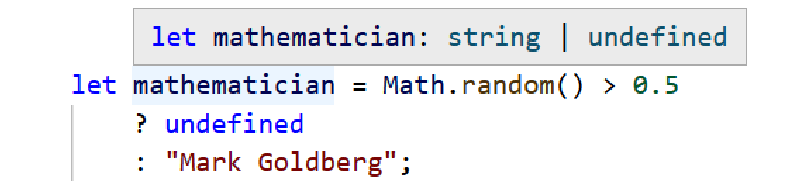

# CHAPTER 3 Unions and Literals

_Nothing is constant
Values may change over time
(well, except constants)_

CHAPTER 3
Unions and Literals
Chapter 2, “The Type System” covered the concept of the “type system” and how it
can read values to understand the types of variables. Now I’d like to introduce two key
concepts that TypeScript works with to make inferences on top of those values:

- **Unions**
  Expanding a value’s allowed type to be two or more possible types
- **Narrowing**
  Reducing a value’s allowed type to not be one or more possible types
  Put together, unions and narrowing are powerful concepts that allow TypeScript to
  make informed inferences on your code many other mainstream languages cannot.

##  Union Types
Take this mathematician variable:
```ts
let mathematician = Math.random() > 0.5 ? undefined : "Mark Goldberg";
```
What type is mathematician?

It’s neither only undefined nor only string, even though those are both potential
types. mathematician can be either undefined or string. This kind of “either or”
type is called a `union`. Union types are a wonderful concept that let us handle code
cases where we don’t know exactly which type a value is, but do know it’s one of two
or more options.

TypeScript represents union types using the | (pipe) operator between the possible
values, or constituents. The previous mathematician type is thought of as string |
undefined. Hovering over the mathematician variable would show its type as string
| undefined (Figure 3-1).


Figure 3-1. TypeScript reporting the mathematician variable as being type string |
undefined