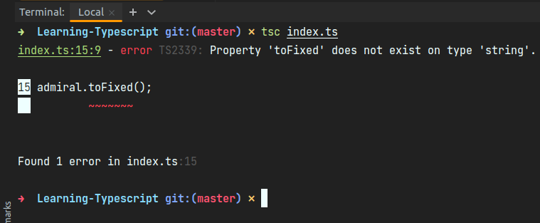
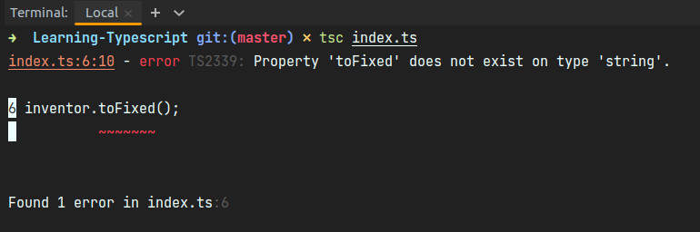

# CHAPTER 3 Unions and Literals

- [CHAPTER 3 Unions and Literals](#chapter-3-unions-and-literals)
  - [Union Types](#union-types)
    - [Declaring Union Types](#declaring-union-types)
    - [Union Properties](#union-properties)
  - [Narrowing](#narrowing)


_Nothing is constant
Values may change over time
(well, except constants)_

CHAPTER 3
Unions and Literals
Chapter 2, “The Type System” covered the concept of the “type system” and how it
can read values to understand the types of variables. Now I’d like to introduce two key
concepts that TypeScript works with to make inferences on top of those values:

- **Unions**
  Expanding a value’s allowed type to be two or more possible types
- **Narrowing**
  Reducing a value’s allowed type to not be one or more possible types
  Put together, unions and narrowing are powerful concepts that allow TypeScript to
  make informed inferences on your code many other mainstream languages cannot.

## Union Types

Take this mathematician variable:

```ts
let mathematician = Math.random() > 0.5 ? undefined : "Mark Goldberg";
```

What type is mathematician?

It’s neither only undefined nor only string, even though those are both potential
types. mathematician can be either undefined or string. This kind of “either or”
type is called a `union`. Union types are a wonderful concept that let us handle code
cases where we don’t know exactly which type a value is, but do know it’s one of two
or more options.

TypeScript represents union types using the | (pipe) operator between the possible
values, or constituents. The previous mathematician type is thought of as string |
undefined. Hovering over the mathematician variable would show its type as string
| undefined (Figure 3-1).


Figure 3-1. TypeScript reporting the mathematician variable as being type string |
undefined

### Declaring Union Types

Union types are an example of a situation when it might be useful to give an explicit
type annotation for a variable even though it has an initial value. In this example,
thinker starts off null but is known to potentially contain a string instead. Giving
it an explicit string | null type annotation means TypeScript will allow it to be
assigned values of type string:

```ts
let tinker:string|null = null;
if(Math.random()>0.5){
    tinker = "SUSAN LANGER";//ok
}
```

Union type declarations can be placed anywhere you might declare a type with a type
annotation.

*The order of a union type declaration does not matter. You can
write boolean | number or number | boolean and TypeScript will
treat both the exact same.*

### Union Properties

When a value is known to be a union type, TypeScript will only allow you to access
member properties that exist on all possible types in the union. It will give you a
type-checking error if you try to access a type that doesn’t exist on all possible types.

In the following snippet, physicist is of type number | string. While .toString()
exists in both types and is allowed to be used, .toUpperCase() and .toFixed()
are not because .toUpperCase() is missing on the number type and .toFixed() is
missing on the string type:

```ts
let physicist = Math.random() > 0.5 ? "Marie Curie" : 84;
physicist.toString(); // Ok
physicist.toUpperCase();
// ~~~~~~~~~~~
// Error: Property 'toUpperCase' does not exist on type 'string | number'.
// Property 'toUpperCase' does not exist on type 'number'.
physicist.toFixed();
// ~~~~~~~
// Error: Property 'toFixed' does not exist on type 'string | number'.
// Property 'toFixed' does not exist on type 'string'.
```

Restricting access to properties that don’t exist on all union types is a safety measure.
If an object is not known to definitely be a type that contains a property, TypeScript
will believe it unsafe to try to use that property. The property might not exist!

To use a property of a union typed value that only exists on a subset of the potential
types, your code will need to indicate to TypeScript that the value at that location in
code is one of those more specific types: a process called narrowing.

## Narrowing

Narrowing is when TypeScript infers from your code that a value is of a more specific
type than what it was defined, declared, or previously inferred as. Once TypeScript
knows that a value’s type is more narrow than previously known, it will allow you to
treat the value like that more specific type. A logical check that can be used to narrow
types is called a `type guard`.

Let’s cover two of the common type guards TypeScript can use to deduce type
narrowing from your code.

### Assignment Narrowing
If you directly assign a value to a variable, TypeScript will narrow the variable’s type
to that value’s type.

Here, the admiral variable is declared initially as a number | string, but after being
assigned the value "Grace Hopper", TypeScript knows it must be a string:

```ts
let admiral:string|number;

admiral = "kevin";

admiral.toLowerCase();
admiral.toFixed();
```
here we can see 



Assignment narrowing comes into play when a variable is given an explicit union
type annotation and an initial value too. TypeScript will understand that while the
variable may later receive a value of any of the union typed values, it starts off as only
the type of its initial value.

In the following snippet, inventor is declared as type number | string, but Type‐
Script knows it’s immediately narrowed to a string from its initial value:

```ts
let inventor:(number | string) = "kevin";

inventor.toLowerCase();
inventor.toFixed();
```



typescript is showing the error when we are trying to use number methods.

### Conditional Checks
